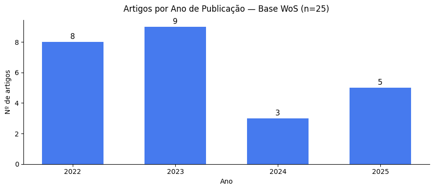
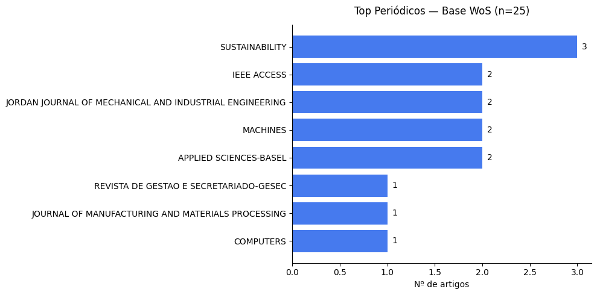
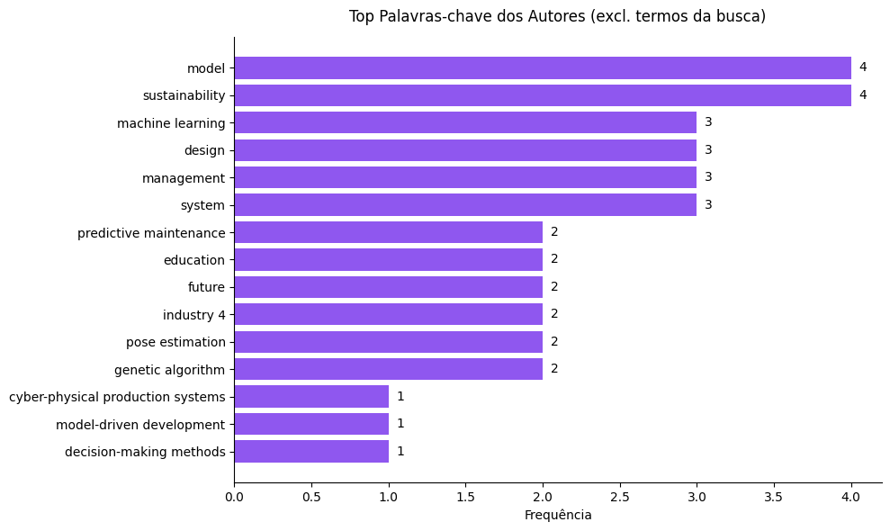
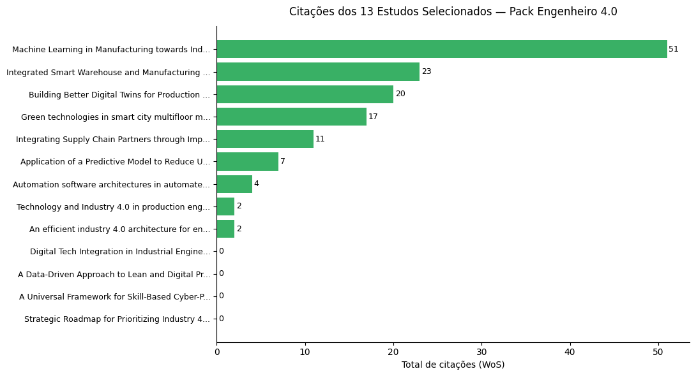

# 📦 Pack Engenheiro 4.0 — Curadoria Bibliométrica

> **Systematic literature curation** aplicada a 25 artigos do Web of Science sobre  
> aplicações práticas da Indústria 4.0 na Engenharia de Produção, resultando em  
> **13 estudos de caso** que fundamentam o conteúdo do Pack Engenheiro 4.0, junto com uma referência complementar (revisão sistemática).

---

## 🎯 Objetivo

Documentar de forma reproduzível o processo de curadoria científica que selecionou  
os 13 estudos de caso reais utilizados no **Pack Engenheiro 4.0** — produto educacional  
técnico com evidências científicas sobre implementação de tecnologias da Indústria 4.0  
em processos de engenharia.

Este repositório expõe o pipeline completo: busca → parsing → EDA → triagem documentada → amostra final.

---

## 🗂️ Estrutura do repositório

```
pack-engenheiro-4.0-screening/
│
├── README.md
├── data/
│   └── savedrecs.ris                   ← Exportação bruta do Web of Science
├── notebooks/
│   └── 01_triagem_pack_eng40.ipynb     ← Pipeline completo de curadoria
├── outputs/
│   ├── base_completa_25.xlsx           ← Todos os 25 artigos com metadados
│   └── amostra_final_13.xlsx           ← Os 13 estudos selecionados
└── assets/
    └── graficos/
        ├── artigos_por_ano.png
        ├── top_periodicos.png
        ├── top_keywords.png
        └── citacoes_selecionados.png
```

---

## 🔬 Metodologia

### 1. Fonte e string de busca
Exportação do **Web of Science — Coleção Principal (Clarivate)**, realizada em 18/03/2025:

```
TS=(("Industry 4.0" OR "Smart Manufacturing" OR "Digital Transformation")
AND ("Quality Management" OR "Quality 4.0" OR "Total Quality Management")
AND ("Case Study" OR "Practical Application" OR "Implementation"))
AND PY=(2021-2025)
AND DT=Review Article
```

**Resultado:** 25 artigos

### 2. Critérios de triagem manual
A seleção dos 13 estudos foi realizada por leitura de títulos e resumos, aplicando:

**Inclusão:**
- Estudo de caso real com empresa/instituição identificável
- Tecnologia habilitadora da I4.0 aplicada em contexto industrial
- Resultados mensuráveis reportados

**Exclusão:**
- Foco exclusivo em educação de engenharia, sem aplicação industrial
- Trabalhos de conferência
- Contribuição majoritariamente teórica sem validação empírica

### 3. Resultado

| Etapa | N |
|---|---|
| Recuperados no Web of Science | 25 |
| Excluídos na triagem | 12 |
| **Selecionados para o Pack** | **13** |

---

## 🛠️ Tecnologias utilizadas


- `rispy` — parsing de arquivos RIS exportados do WoS
- `pandas` — manipulação e análise dos metadados
- `matplotlib` / `seaborn` — visualizações exploratórias
- Ambiente: Google Colab

---

## ▶️ Como reproduzir

```bash
# 1. Clone o repositório
git clone https://github.com/Engineer-Ana/pack-engenheiro-4.0-screening.git
cd pack-engenheiro-4.0-screening

# 2. Instale as dependências
pip install rispy pandas matplotlib seaborn openpyxl jupyter

# 3. Execute o notebook
jupyter notebook notebooks/01_triagem_pack_eng40.ipynb
```

> Ajuste o caminho do arquivo RIS na célula de carregamento conforme seu ambiente.

---

## 📈 Resultados visuais

*Gráficos gerados automaticamente pelo notebook (ver pasta `/assets/graficos/`)*

| Distribuição por ano | Top periódicos |
|---|---|
|  |  |

| Top palavras-chave | Citações dos selecionados |
|---|---|
|  |  |

---

## 🔗 Contexto do projeto

Este repositório documenta a curadoria científica por trás do **Pack Engenheiro 4.0**  
— um produto educacional técnico que consolida 14 estudos de caso reais sobre  
implementação de tecnologias da Indústria 4.0 em processos de engenharia de produção.

O Pack é voltado para engenheiros e profissionais que buscam evidências científicas  
para fundamentar projetos de transformação digital industrial.

> 🛒 Disponível em: [link do produto]

---

## 👩‍💻 Sobre a autora

**Ana Maria Barbosa Dias**  
Engenheira de Produção | Mestre em Engenharia Têxtil (Indústria 4.0) — UFSC

Pesquisadora e produtora de conteúdo técnico na interseção entre  
**engenharia industrial**, **pesquisa aplicada** e **análise de dados**.

[](https://linkedin.com/in/seu-perfil)
[](https://github.com/Engineer-Ana)

---

## 📄 Licença

Uso educacional e demonstrativo.  
Dados provenientes de fontes públicas — Web of Science (Clarivate).
